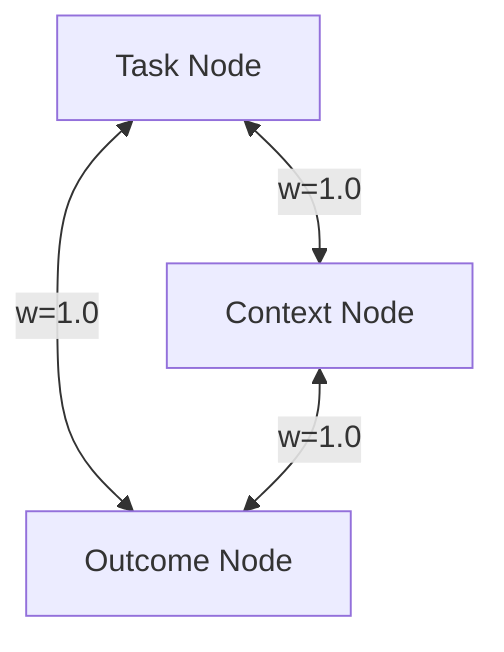

# Triad Topology (The Memory Graph)

**Triad Topology** is the fundamental data structure of the Intent Memory Engine.

Instead of storing an intent as a flat text record (like traditional RAG), IntentHub preserves an "atomic episode of reality" as a tightly coupled triangle (graph). This allows the system to navigate not just by semantic similarity (Vector Search) but also by causal relationships (Graph Traversal).

## 1. The Triad Structure

When ingested, every Intent is expanded into three distinct nodes:

Where:

- **Task Node** – what action was requested or performed.
- **Context Node** – under which conditions, constraints, or environment the task was handled.
- **Outcome Node** – what actually happened: result, artifact, error pattern, or side-effect.